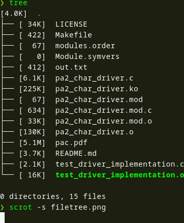

[](https://travis-ci.com/TralahM/linux_kernel_module)
[](https://ci.appveyor.com/project/TralahM/linux_kernel_module/branch/master)
[](https://linux_kernel_module.readthedocs.io/en/latest/?badge=latest)
[](https://opensource.org/licenses/GPLV2)
[](https://github.com/TralahTek)
[](https://github.com/TralahM/linux_kernel_module/pull/)
[](https://github.com/TralahM/linux_kernel_module/pull/)
[](https://github.com/TralahM)
<noscript><a href="https://liberapay.com/TralahM/donate"></a></noscript>

# linux_kernel_module.


[](https://github.com/TralahTek)
[](https://github.com/TralahM)
[](https://github.com/TralahM)

# Documentation

[](https://github.com/TralahM/linux_kernel_module)


## Building from Source for Developers
Ensure that the `linux-headers` are installed for your current kernel as
indicated by `uname -r`.

```console
$ git clone https://github.com/TralahM/linux_kernel_module.git
$ cd linux_kernel_module
$ make
```


### output should be




```console
$ sudo insmod pa2_char_driver.ko
$ sudo dmesg
```
Find the command to create a supported character device with major and minor
numbers using `dmesg` or `cat /var/log/syslog`.

The Output is Similar to this:

```
[ 2745.881449] INIT Function Called.
[ 2745.881453] Device Number 535822336 MAJ:511 MIN:0
[ 2745.881454] I was assigned major number 511. To talk to
[ 2745.881454] the driver, create a dev file with
[ 2745.881454] 'mknod /dev/simple_char_device -m 777 c 511 0'.
[ 2745.881455] Try various minor numbers. Try to cat and echo to
[ 2745.881455] the device file.
[ 2745.881456] Remove the device file and module when done.

```

After running `insmod` the appropriate device will be created automatically for
you and removed when you call `rmmod`.

if for som reason however it is not created,
Then Run the command `sudo mknod /dev/simple_char_device -m 777 c 511 0`


# Testing.

Run
```
$ make test
$ make runtest
$ cat /dev/simple_char_device
$ sudo dmesg
```

Should show the number of times the device was opened and closed.


# Contributing
[See the Contributing File](CONTRIBUTING.rst)


[See the Pull Request File](PULL_REQUEST_TEMPLATE.md)


# Support

# LICENCE

[Read the license here](LICENSE)


# Self-Promotion

[](https://github.com/TralahM)
[](https://twitter.com/TralahM)
[](https://kaggle.com/TralahM)
[](https://linkedin.com/in/TralahM)


[](https://tralahm.tralahtek.com)

[](https://org.tralahtek.com)


